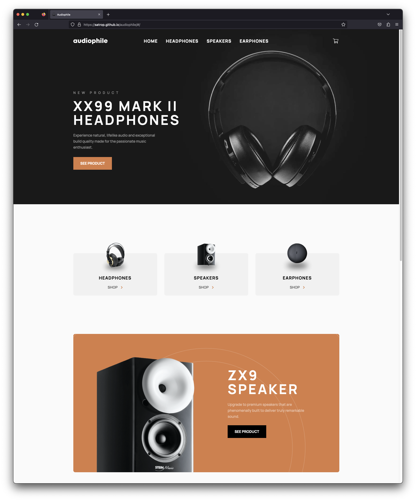

# [Frontend Mentor - Audiophile e-commerce website](https://www.frontendmentor.io/challenges/audiophile-ecommerce-website-C8cuSd_wx)

## Overview

-   [Live Site](https://satrop.github.io/audiophile/#/)

## My process

### Built with ❤️

-   Semantic HTML5 markup
-   SCSS with custom properties
-   Flexbox
-   CSS Grid
-   Mobile-first workflow
-   React

---

### 📝 Brief

The challenge was to build out this multi-page e-commerce website and get it looking as close to the design as possible.

Can use a JS-heavy approach, with provided local data.json file for the products.
